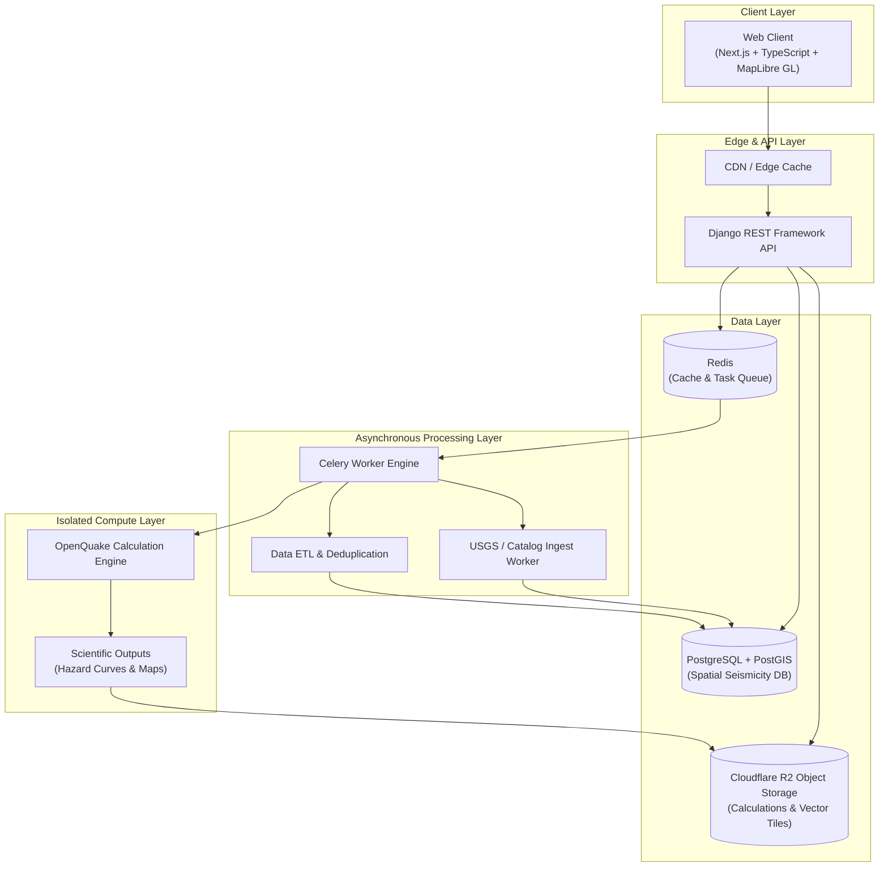

# SeismoAtlas — Documentation Hub & Architecture Specification

Welcome to the **SeismoAtlas** documentation repository. SeismoAtlas is a global, map-first platform for exploring earthquake history, tectonic context, probabilistic seismic hazard, and seismic risk intelligence.

> [!IMPORTANT]
> **Scientific Positioning & Platform Mandate**
> SeismoAtlas does **not** claim to predict the exact date, location, or magnitude of earthquakes. Instead, it delivers scientifically defensible hazard metrics—including historical event rates, hazard curves, probabilities of exceedance, ground-motion estimations, and risk indicators.

---

## High-Level System Architecture

The following diagram details the high-level architecture of SeismoAtlas, highlighting component boundaries, data persistence, queue-based background tasks, and isolated scientific compute workers.



---

## Role-Based Navigation Guide

Select your role below to jump straight to the documentation relevant to your domain:

| Developer Role | Key Documentation & Specifications | Primary Focus |
| :--- | :--- | :--- |
| **System Architect / Lead** | [System Architecture](file:///home/salah-uddin/EarthQuick/docs/architecture/system-architecture.md)<br/>[Shared Contracts & Workspaces](file:///home/salah-uddin/EarthQuick/docs/architecture/shared-contracts-and-common.md)<br/>[Milestones & Delivery](file:///home/salah-uddin/EarthQuick/docs/roadmap/milestones-and-delivery.md) | C4 System design, monorepo structure, uv workspaces, shared contracts, delivery timeline. |
| **Backend & Database Engineer** | [Django Backend Architecture](file:///home/salah-uddin/EarthQuick/docs/architecture/django-backend-architecture.md)<br/>[Data Storage & Indexing](file:///home/salah-uddin/EarthQuick/docs/architecture/data-storage-and-indexing.md)<br/>[API Specification](file:///home/salah-uddin/EarthQuick/docs/api/api-specification.md) | Centralized DRF core package (`core/`), RBAC permissions, standardized pagination, PostGIS schemas, REST API. |
| **Frontend Engineer** | [Frontend Architecture](file:///home/salah-uddin/EarthQuick/docs/architecture/frontend-architecture.md)<br/>[UX Wireframes & Flows](file:///home/salah-uddin/EarthQuick/docs/product/user-experience-and-flows.md)<br/>[API Specification](file:///home/salah-uddin/EarthQuick/docs/api/api-specification.md) | Next.js App Router, feature modules, TanStack Query, MapLibre GL, Zustand stores, provenance UI. |
| **Data & GIS Engineer** | [Pipeline & Ingestion](file:///home/salah-uddin/EarthQuick/docs/data/pipeline-and-ingestion.md)<br/>[Data Sources & Provenance](file:///home/salah-uddin/EarthQuick/docs/data/data-sources-and-provenance.md) | Ingestion ETL, catalog deduplication algorithms, spatial indexing, USGS ANSS integration. |
| **Seismologist / Data Scientist** | [Scientific Methodology](file:///home/salah-uddin/EarthQuick/docs/scientific/scientific-methodology.md)<br/>[Hazard & Risk Modeling](file:///home/salah-uddin/EarthQuick/docs/scientific/hazard-and-risk-modeling.md)<br/>[Validation & Reproducibility](file:///home/salah-uddin/EarthQuick/docs/scientific/validation-and-reproducibility.md) | PSHA theory, OpenQuake Engine integration, hazard curves, loss estimation, reproducibility tracking, test suites. |
| **DevOps & SRE Engineer** | [Infrastructure & Security](file:///home/salah-uddin/EarthQuick/docs/operations/infrastructure-and-security.md)<br/>[CI/CD & Observability](file:///home/salah-uddin/EarthQuick/docs/operations/ci-cd-and-observability.md) | Docker Compose, cloud architecture, worker isolation, GitHub Actions pipelines, telemetry metrics, alerts. |

---

## Documentation Directory Index

```text
docs/
├── README.md                          # Central documentation hub & High-Level Architecture
├── architecture/
│   ├── system-architecture.md          # Monorepo Structure, Components & Tech Stack
│   ├── django-backend-architecture.md # Centralized Core Package (RBAC, Pagination, Base Services)
│   ├── frontend-architecture.md       # Next.js Feature Modules, MapLibre GL & State Stores
│   ├── shared-contracts-and-common.md # uv Workspaces, Shared API Envelopes & GeoJSON Specs
│   └── data-storage-and-indexing.md   # PostgreSQL/PostGIS Schemas & Spatial Indexing
├── product/
│   ├── product-spec-and-scope.md      # Product Goals, Scope & Non-Goals
│   └── user-experience-and-flows.md   # UI Wireframes, User Journeys & Provenance UI
├── features/                          # [NEW] Granular Feature Specifications (Status: PENDING)
│   ├── README.md                      # Feature Specs Index (FEAT-01 to FEAT-10)
│   ├── 01-earthquake-explorer-map.md
│   ├── 02-earthquake-catalog-ingestion.md
│   ├── 03-location-intelligence.md
│   ├── 04-tectonic-context.md
│   ├── 05-probabilistic-hazard-curves.md
│   ├── 06-seismic-threshold-probabilities.md
│   ├── 07-scientific-data-provenance.md
│   ├── 08-scenario-shaking-analysis.md
│   ├── 09-seismic-risk-loss-estimation.md
│   └── 10-export-and-citations.md
├── scientific/
│   ├── scientific-methodology.md      # Hazard vs. Risk & AI Explanation Standards
│   ├── hazard-and-risk-modeling.md    # OpenQuake Engine, PSHA & Scenario Modeling
│   └── validation-and-reproducibility.md # 4-Layer Scientific Validation & Auditability
├── data/
│   ├── pipeline-and-ingestion.md      # ETL Pipeline, Deduplication & Storage Strategy
│   └── data-sources-and-provenance.md # Authoritative Data Hierarchy & Provenance Metadata
├── api/
│   └── api-specification.md           # API Endpoints, Envelopes & Caching Policies
├── operations/
│   ├── infrastructure-and-security.md # Deployment, Cloud Infrastructure & Security Controls
│   └── ci-cd-and-observability.md     # CI/CD Workflows, Health Metrics & Monitoring Alerts
└── roadmap/
    └── milestones-and-delivery.md     # MVP Roadmap, Milestones & Definition of Done
```

---

## Recommended First Vertical Slice

To minimize engineering and scientific risk, initial development strictly adheres to the following vertical slice before integrating advanced probabilistic hazard engines:

```text
USGS API Ingestion  ──>  Django Normalization  ──>  PostgreSQL/PostGIS  ──>  Django REST API  ──>  Next.js + MapLibre
```
