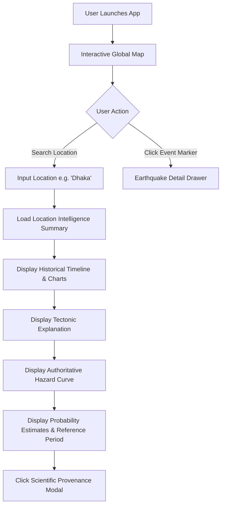

# User Experience & Interactive Flows

This document specifies the user interface wireframes, user journeys, data provenance UI components, and public safety communication standards for **SeismoAtlas**.

---

## 1. Interface Wireframes

### 1.1 Landing Page Layout

```text
-----------------------------------------------------
 SEISMOATLAS
 Global Earthquake Hazard Intelligence
-----------------------------------------------------

[ Search city, country, coordinates... ]

[ Interactive World Map (MapLibre GL) ]

Recent Earthquakes  │  Historical Activity  │  Hazard Layers  │  Tectonics  │  Risk
-----------------------------------------------------
```

### 1.2 Location Intelligence Page

```text
Dhaka, Bangladesh

Seismic Hazard Status: HIGH / MODEL-DEPENDENT

Why?
 - Regional tectonic setting: Indo-Burma / Himalayan collision
 - Relevant seismic sources: Dauki Fault, Madhupur Fault
 - Historical seismicity: 1897 Great Assam Event (M 8.1)
 - Local site conditions: Deep alluvial sediment

Last Significant Earthquakes:
[ Timeline Widget ]

Historical Activity:
[ Frequency & Magnitude Distribution Charts ]

Hazard Information:
[ Hazard Curve / PGA Map ]

Probability Estimate:
M ≥ 6.0 over 30-year window: ~15-25% (Model Dependent)
[ Model + Source + Uncertainty Metadata ]

Scientific Sources:
[ Provenance & Citation Metadata ]
```

### 1.3 Earthquake Detail View

```text
Magnitude: Mw 6.2
Depth: 18 km
Origin Time: 2026-09-15 14:32:10 UTC
Location: 24.12°N, 90.45°E
Region: Mymensingh, Bangladesh

Tectonic Setting: Shallow crustal faulting near plate margin
Distance from Selected City: 65 km N of Dhaka

Data Sources:
USGS ANSS ComCat / Regional Seismic Network
```

---

## 2. End-to-End User Journey Flow



---

## 3. Data Provenance UI Component

Every scientific figure displayed on the user interface features an interactive **Scientific Basis** badge (`ⓘ`). Clicking or hovering over the badge opens a standardized provenance popover:

```text
-----------------------------------------------------
ⓘ Scientific Basis & Provenance
-----------------------------------------------------
Source Agency:      USGS / Global Earthquake Model (GEM)
Dataset Name:       ANSS ComCat / GEM Global Hazard Map
Model Identifier:   GEM-PSHA-2023.1
Model Version:      v2.4
Calculation Date:   2026-01-15
Reference Period:   50-Year Window (10% Exceedance)
Units:              Peak Ground Acceleration (g)
Uncertainty Range:  0.18g - 0.28g (95% CI)
Limitations:        Site amplifications based on Vs30 grid.
-----------------------------------------------------
```

---

## 4. User Safety & Public Communication Standard

To protect users and prevent public panic, all text copy across the application strictly adheres to scientific communication guidelines:

| ❌ STRICTLY PROHIBITED LANGUAGE | ✅ SCIENTIFICALLY DEFENSIBLE ALTERNATIVES |
| :--- | :--- |
| "An earthquake will strike Dhaka next month." | "Statistical hazard models estimate a probability over a 30-year window." |
| "This region is overdue for a magnitude 7 earthquake." | "Historical seismicity indicates an average recurrence interval of X years under Model Y." |
| "Our AI system predicts seismic activity." | "Our platform visualizes authoritative probabilistic hazard models." |
| "This city is 100% safe from major earthquakes." | "Current models estimate low ground motion thresholds for the selected return period." |
| "Guaranteed accurate prediction engine." | "Estimates are subject to model assumptions, input datasets, and epistemic uncertainties." |
